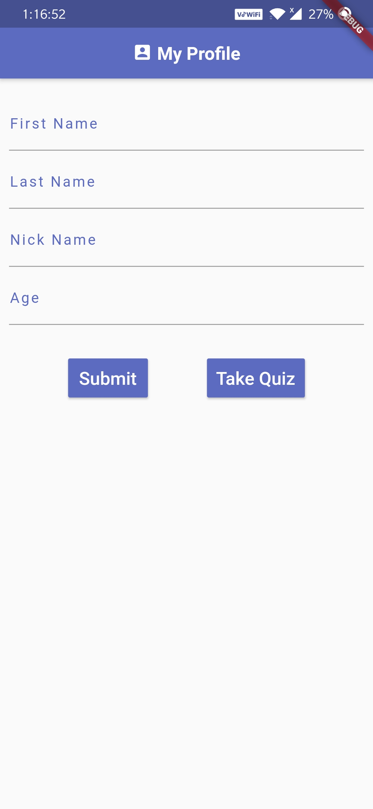
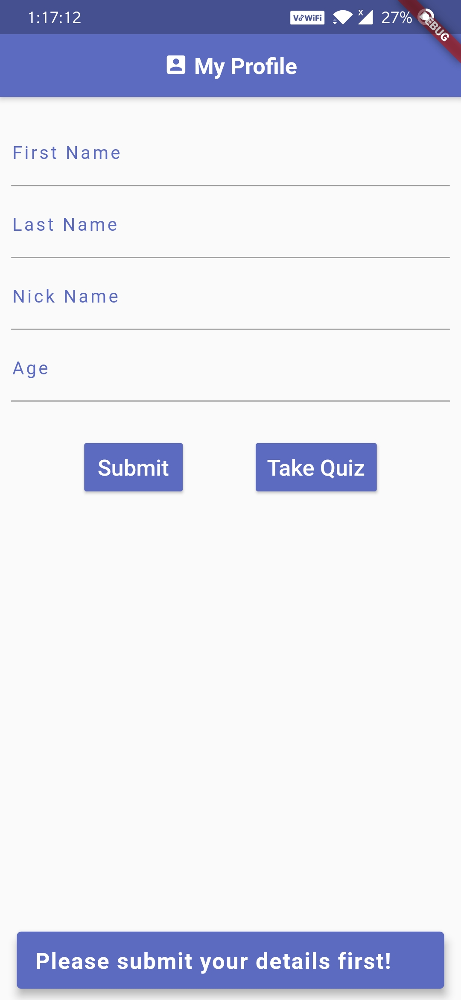
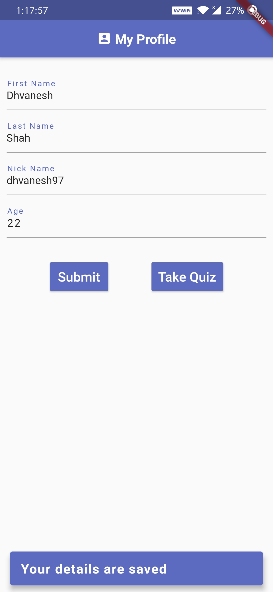
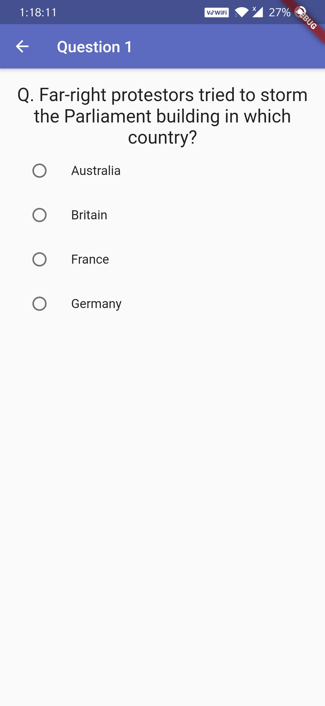
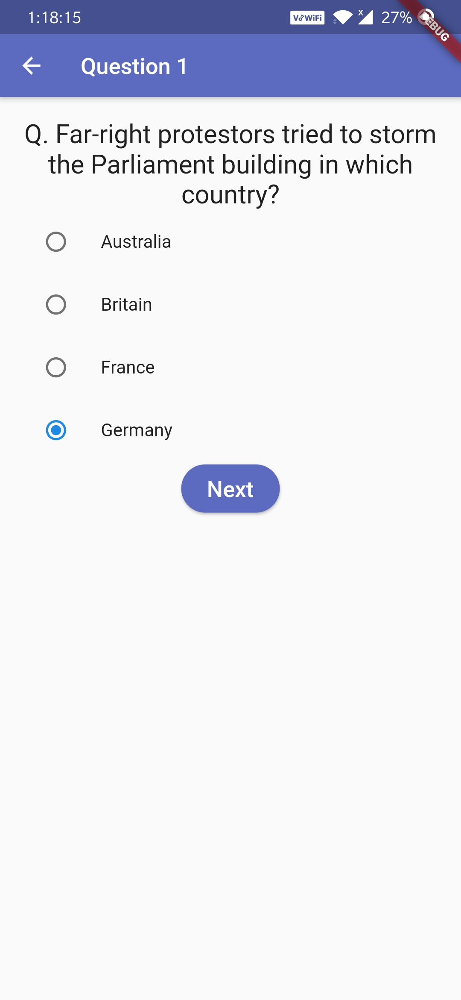
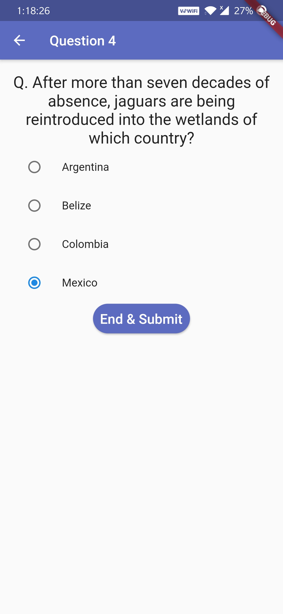
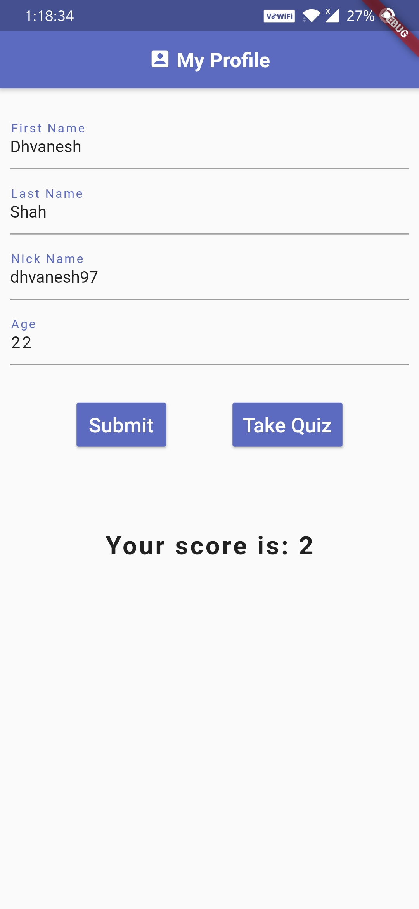

# CoolQuiz (Flutter - Dart)

<table>
<tr>
<td>
<strong>A simple yet elegant Quiz App developed with Flutter.</strong>
</td>
</tr>
</table>

## Some of the Widgets and Plugins used

* TextFormField
* Buttons
* Snackbar
* Shared Preferences
* Files
* FutureBuilder
* Builder
* Row
* Columns etc.

## Features

* Saves user information with Shared preferences
* Saves quiz score in a file, so when user restarts the app, he/she can check the previous score
* User can revisit the question and correct it
* User friendly design

## Requirements

- Flutter
- Either VS Code or Android Studio
- Both editors require Flutter & dart plugins installation 

## Setup 

- clone the repo and run app on your plugged phone/Android Emulator

## Screenshots

<table>
  <tr>
    <td>Splash Screen</td>
    <td>Home Screen</td>
    <td>Must submit details berfore quiz</td>
  </tr>
  <tr>
    <td valign="top"></td>
    <td valing="top"></td>
    <td valing="top"></td>
  </tr>
  <tr>
    <td>Save Details in Shared Preference</td>
    <td>Quiz Question</td>
    <td>Show Next on selecting option</td>
  </tr>
  <tr>
    <td valign="top"></td>
    <td valign="top"></td>
    <td valign="top"></td>
  </tr>
  <tr>
    <td>Show end on last question</td>
    <td>Redirect to Home Screen & show score</td>
    <td>show score and details on restart app</td>
  </tr>
  <tr>
    <td valign="top"></td>
    <td valign="top"></td>
    <td valign="top"></td>
  </tr>
 </table>

  
 

## Getting Started

This project is a starting point for a Flutter application.

A few resources to get you started if this is your first Flutter project:

* [Lab: Write your first Flutter app](https://flutter.dev/docs/get-started/codelab)
* [Cookbook: Useful Flutter samples](https://flutter.dev/docs/cookbook)

For help getting started with Flutter, view our
[online documentation](https://flutter.dev/docs), which offers tutorials, 
samples, guidance on mobile development, and a full API reference.
